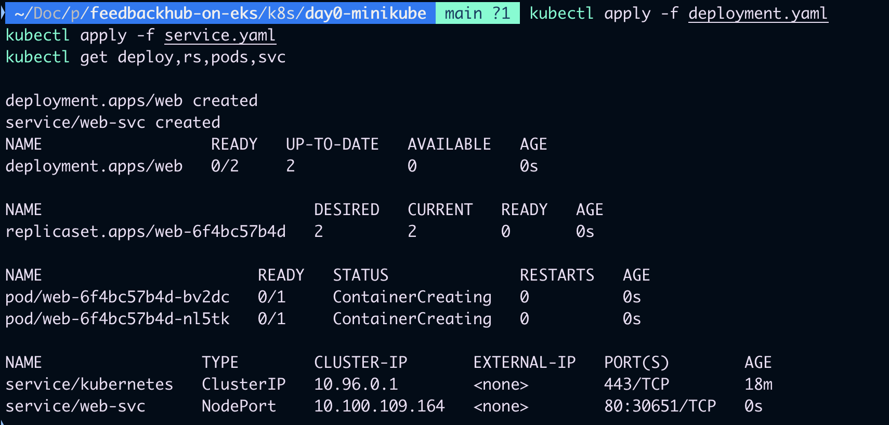
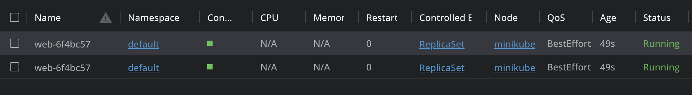
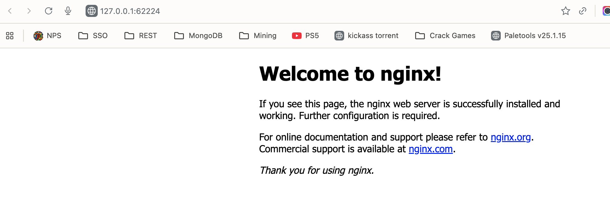
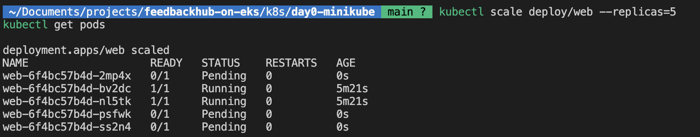
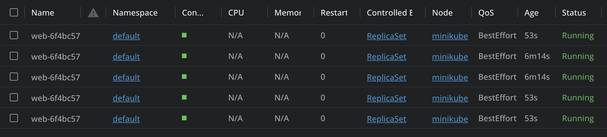
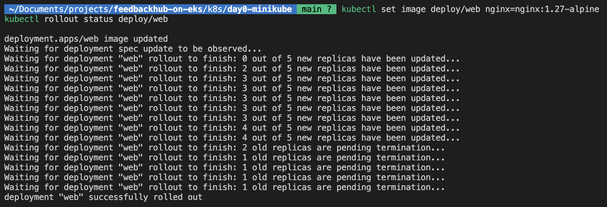
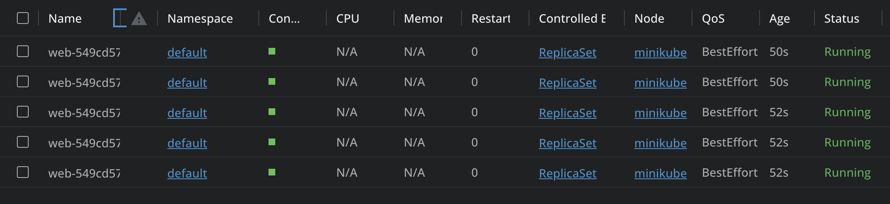
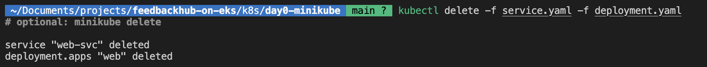
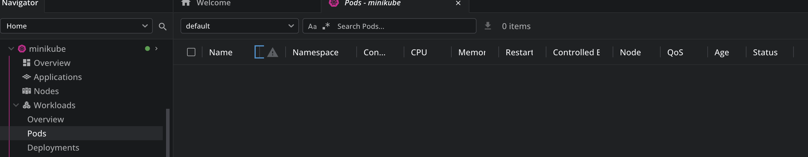

## Phase 0 – Day 0: Kubernetes Foundations (Minikube + Lens)

Hands-on primer to “see” Kubernetes: start a local cluster with minikube, deploy NGINX, and explore it live in Lens. Includes scaling and rolling updates to visualize core Kubernetes behaviors.

---

### What you’ll learn
- **Deployment vs Pods**: how a Deployment manages Pods and replicas
- **Service exposure**: how a Service targets Pods (NodePort for local)
- **Operational flow**: rollouts and scaling in real time (via Lens)

### Architecture refresher
- **Control Plane**: API Server, Scheduler, Controller Manager, etcd
- **Workers**: Kubelet, Kube Proxy, Container Runtime (Docker/containerd)

---

## Prerequisites
- Docker Desktop (or Colima)
- `kubectl`
- `minikube`
- Lens (Kubernetes IDE)

On macOS, you can install with Homebrew:

```bash
brew install --cask docker
brew install kubectl minikube
```

Start Docker Desktop before proceeding.

---

## 1) Start a local cluster

```bash
minikube start --driver=docker
kubectl cluster-info
kubectl get nodes -o wide
```

You should see one control-plane node in Ready state.

---

## 2) Deploy NGINX (Deployment + Service)

This folder contains a simple Deployment and NodePort Service:
- `deployment.yaml` → `Deployment/web` running NGINX
- `service.yaml` → `Service/web-svc` exposing port 80

Apply the manifests:

```bash
kubectl apply -f deployment.yaml
kubectl apply -f service.yaml
```

Verify objects:

```bash
kubectl get deploy,rs,pods,svc -o wide
```

Open NGINX in your browser (minikube will proxy to the NodePort):

```bash
minikube service web-svc
```

Proof:







---

## 3) Explore in Lens

Open Lens and add the `minikube` cluster (it will detect your `~/.kube/config`).
- Inspect `Deployments`, `ReplicaSets`, and `Pods`
- Watch logs and live events as you run the commands below

---

## 4) Scale the Deployment

Increase replicas to 5 and watch new Pods appear:

```bash
kubectl scale deploy/web --replicas=5
kubectl get pods -w
```

Proof:





---

## 5) Rolling update

Trigger a rollout by updating the NGINX image tag:

```bash
kubectl set image deploy/web nginx=nginx:1.27-alpine
kubectl rollout status deploy/web
kubectl get rs
```

What to observe:
- A new `ReplicaSet` is created with the updated template
- Pods are replaced gradually to avoid downtime
- Old `ReplicaSet` is retained (allowing quick rollback)

Optional rollback:

```bash
kubectl rollout undo deploy/web
```

Proof:





---

## 6) Clean up

```bash
kubectl delete -f service.yaml -f deployment.yaml
# optional: minikube delete
```

Proof:





---

## Troubleshooting quickies

- **Lens can’t see cluster**: ensure kubeconfig contains the minikube context
  ```bash
  kubectl config get-contexts
  kubectl config use-context minikube
  ```

- **Service not opening**: print the NodePort URL and open it manually
  ```bash
  minikube service web-svc --url
  ```

- **Pods Pending**: check node readiness and Pod events
  ```bash
  kubectl get nodes -o wide
  kubectl describe pod <pod-name>
  ```

- **Image pull issues**: ensure Docker Desktop is running; try a known-good tag
  ```bash
  kubectl set image deploy/web nginx=nginx:1.25-alpine
  ```

---

All screenshots are available under `screenshot/k8s/Day0-minikube`.


